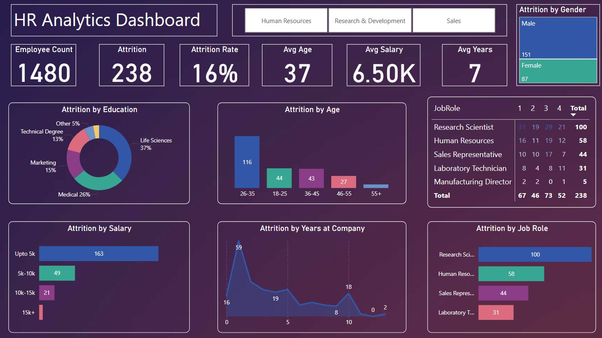
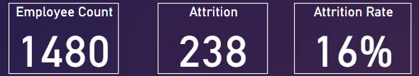
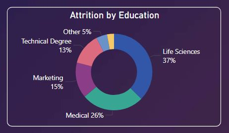
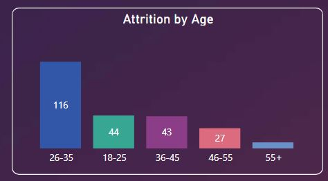
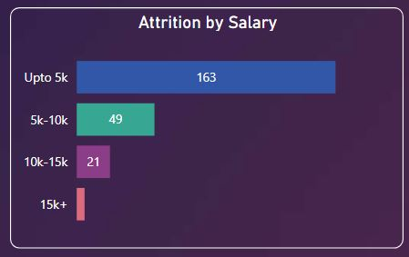
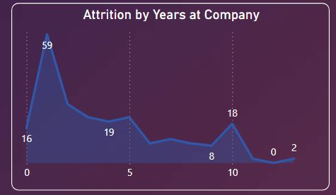

# HR Attrition & Retention Analytics Dashboard

## Business Problem
Employee turnover in a mid-sized company creates financial risk, disrupts workforce stability, and impacts future leadership pipelines. Early identification of high-risk employee segments is essential to maintain operational continuity and retain talent.

## Objective
Provide HR and leadership with actionable insights into attrition trends, particularly focusing on early-career and compensation-sensitive employees, to inform proactive retention strategies.

## Scope
Focus Area: HR Attrition & Retention

## Key Metrics (KPIs)
- Employee Count & Attrition Count
- Overall Attrition Rate
- Attrition segmented by: Gender • Education • Age Group • Salary Band • Years at Company

## Data Preparation & Modeling
Data was prepared and transformed using Power Query:
- Standardized employee demographics (age groups, education levels, salary brackets, gender) and business travel column
- Replaced 'None' entries in numeric columns with 0
- Ensured consistent department and job role names
- Verified data types for accurate calculations in Power BI

## Tools & Technology
- Power BI (Data Modeling, DAX Calculations, Interactive Reporting)
- Data Model Type: Star Schema (1 Fact Table, 3 Dimension Tables)

## Project Structure
```
hr-analytics-dashboard/
 ├── README.md
 ├── assets/              ← screenshots & GIFs
 ├── data/                ← sample datasets
 ├── documentation/       ← Power Query & DAX documentation
 └── powerbi/             ← PBIX files
```

## Insights & Narrative
Attrition is highest among employees aged 26–35 earning up to 5k, primarily within the first 2 years. Male employees account for a larger share of exits. Higher turnover is observed among Life Sciences and Medical roles, with lower attrition in Marketing and Technical roles. Salary and tenure patterns confirm that early-career and lower-compensation employees are at greatest risk.

## Recommendations
- Implement targeted retention programs for early-career employees within the first 2 years, especially those earning up to 5k
- Conduct compensation benchmarking and adjustments for high-risk roles and departments
- Develop career growth and mentorship programs, particularly for Life Sciences and Medical roles
- Apply gender-sensitive retention initiatives where applicable
- Regularly monitor attrition metrics with updated dashboards to identify emerging risks

## Executive Dashboard Preview

### Overview


### KPI Summary


### Attrition by Education


### Attrition by Age


### Attrition by Salary


### Attrition by Years at Company


*All visuals are sourced from the Power BI dashboard and saved in the `assets/` folder for visualization in this portfolio.*
